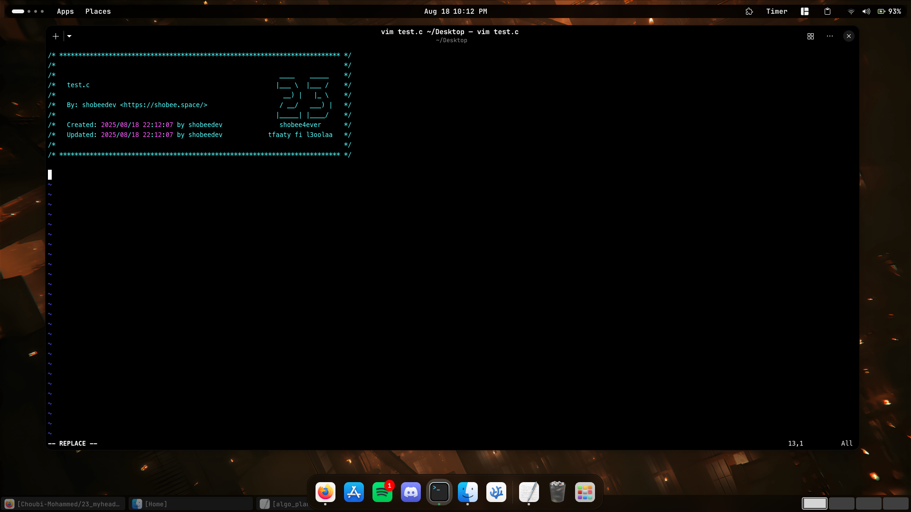

# **23 MyHeader**

23 (shobeedev)

### **Description**

23 standard header for vim editor.



### **UNIX Setup**

Copy `stdheader.vim` in your `~/.vim/plugin`, or use your favorite plugin
manager. Then set the user and mail variables as explained below.

#### Option 1: export USER and MAIL in your shell configuration file

Add in `~/.zshrc` your:

+ `USER`
+ `MAIL`

#### Option 2: set user and mail values directly in your vimrc

```vim
let g:user23 = 'yourLogin'
let g:mail23 = 'yourLogin@unix.23.ma'
```

### **Usage**

In **NORMAL** mode you can use `:Shobee` or simply press the shortcut <kbd>F1</kbd>.

Under **Linux** you eventually need to disable the **help** shortcut of your **terminal** :

For **Terminator**, right click -> Preferences -> Shortcuts -> change help with something other than <kbd>F1</kbd>

`$ ./set_header.sh`

